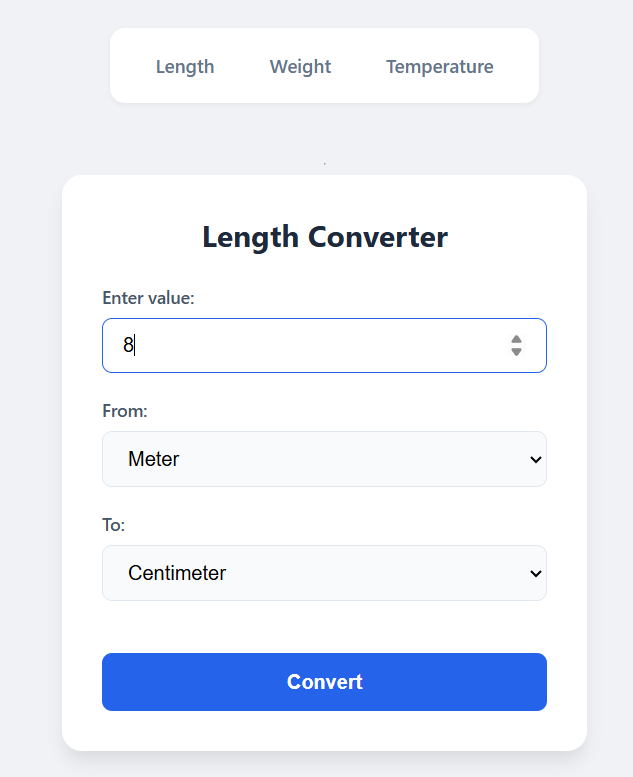
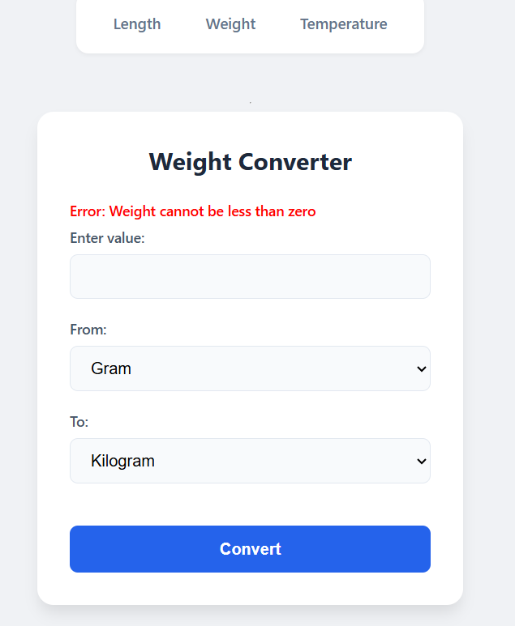

# Unit Converter Web App

Project URL: https://roadmap.sh/projects/unit-converter

A modern, minimalistic web application built with **Python** and **Flask** that allows users to convert various units of length, weight, and temperature.

## 🚀 Features
- **Length Conversion:** Millimeters, centimeters, meters, kilometers, inches, feet, yards, miles.
- **Weight Conversion:** Milligrams, grams, kilograms, ounces, pounds.
- **Temperature Conversion:** Celsius, Fahrenheit, Kelvin.
- **Physical Validation:** Prevents invalid inputs (e.g., negative length/weight or temperatures below absolute zero).
- **Modern UI:** Clean, responsive design with a focus on user experience.

## 🛠 Technology Stack
- **Backend:** Python 3.x, Flask
- **Frontend:** HTML5, CSS3 (Modern Flexbox layout), Jinja2 templates
- **Logic:** Object-Oriented Programming (OOP), Static Methods, Lambda functions

## 📦 Installation & Setup

1. **Clone the repository:**
   ```bash
   git clone [https://github.com/DeLorean08/unit-converter-flask](https://github.com/DeLorean08/unit-converter-flask)
   cd unit-converter-flask

# Create and activate a virtual environment:
python -m venv venv
# On Windows:
venv\Scripts\activate
# On macOS/Linux:
source venv/bin/activate

# Install dependencies:
pip install flask

# Run the application:
python app.py
The app will be available at http://127.0.0.1:5000.

## 📝 Project Structure
app.py - Flask application and routing.

logic.py - Core conversion logic and unit definitions.

templates/ - HTML templates (Base, Length, Weight, Temperature).

static/ - CSS styles for the UI.



